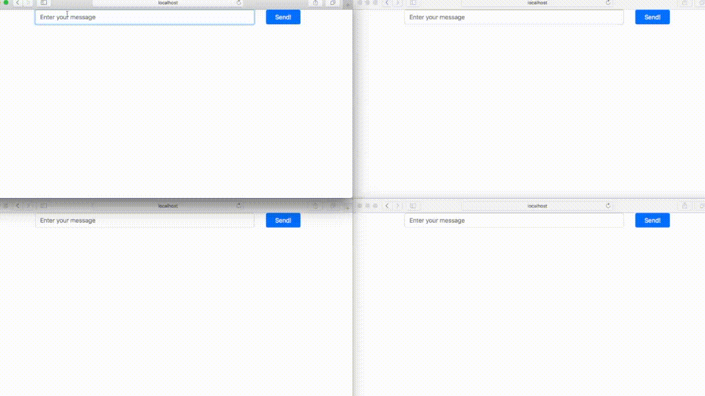

### Websockets, Socket-IO, and Node examples for reference



---

### Getting started

1. enter a directory

```sh
$ cd CHOOSE_DIRECTORY
```

2. install dependencies

```sh
$ npm install
```

3. start server

```sh
$ npm start
```
